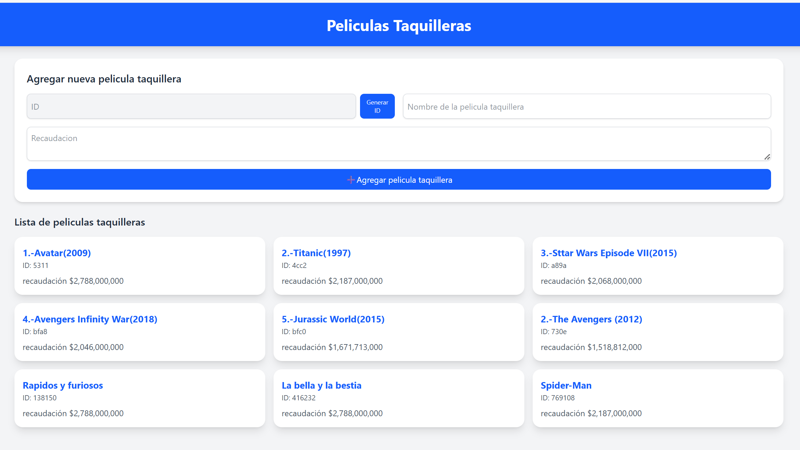

# 🎬 Películas Taquilleras - Frontend con API REST

Este proyecto es una aplicación web sencilla para **gestionar películas
taquilleras** consumiendo una API REST. Permite listar, agregar y
visualizar películas con sus respectivos datos.

## 📂 Archivos principales

### `index.html`

-   Interfaz principal construida con **HTML5** y estilos usando
    **TailwindCSS** (vía CDN).\
-   Contiene:
    -   Un **formulario** para agregar nuevas películas taquilleras.
    -   Un **botón para generar IDs aleatorios**.
    -   Una **sección dinámica** para mostrar la lista de películas
        obtenidas desde la API.
    -   Un **sistema de notificaciones** (mensajes de éxito o error).

### `app.js`

-   Archivo JavaScript encargado de la **lógica de interacción con la
    API**.\
-   Funcionalidades:
    -   `cargarPeliculas()`: Obtiene las películas desde el servidor
        (`http://localhost:3000/taquillera`) y las renderiza.
    -   `MostrarPeliculas(lista)`: Renderiza todas las películas en
        tarjetas.
    -   `renderizarPelicula(pelicula)`: Agrega dinámicamente una nueva
        película a la lista.
    -   `mostrarNotificacion(mensaje, tipo)`: Muestra alertas de éxito o
        error.
    -   `generarID()`: Genera IDs únicos para nuevas películas.
    -   **Eventos:**
        -   `submit` en el formulario → envía una nueva película al
            backend.
        -   `click` en el botón "Generar ID" → asigna un ID aleatorio al
            input.

## 🚀 Requisitos

-   Un servidor backend REST que exponga la ruta:

        GET  /taquillera   → Listar películas
        POST /taquillera   → Agregar nueva película

    (Por defecto configurado en `http://localhost:3000`).

-   Navegador moderno con soporte para **Fetch API**.

## ▶️ Uso

1.  Abre el archivo `index.html` en tu navegador.\
2.  Haz clic en **Generar ID** para crear un identificador único.\
3.  Completa los campos **Nombre de la película** y **Recaudación**.\
4.  Pulsa **Agregar película taquillera** para enviarla al backend.\
5.  La película se mostrará automáticamente en la lista.

## 🎨 Tecnologías utilizadas

-   **HTML5**
-   **JavaScript**
-   **TailwindCSS** (via CDN)
-   **Fetch API**
-   **REST API (backend requerido)**

## 📸 Captura (ejemplo de interfaz)

